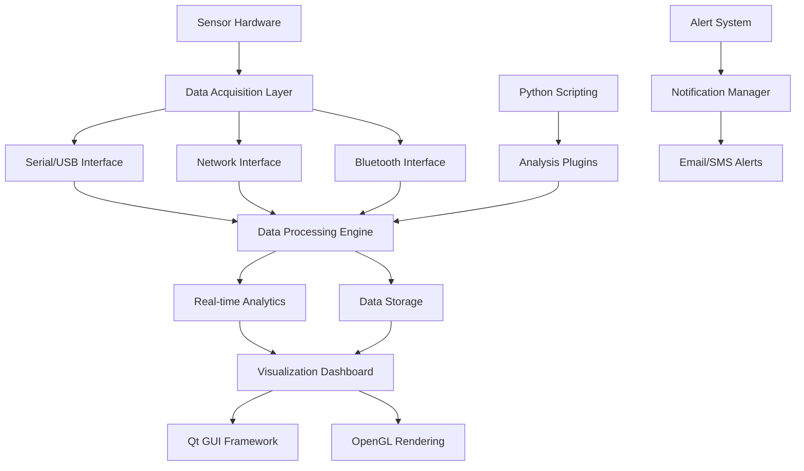

Real-Time Sensor Analysis Dashboard

[](https://isocpp.org)
[](https://qt.io)
[](https://python.org)
[](https://opengl.org)
[](LICENSE)

A high-performance desktop application for real-time sensor data acquisition, analysis, and visualization. Designed for scientific research, industrial monitoring, and IoT applications.

## 🌟 Key Features

- **Multi-protocol sensor support** (Serial, USB, Ethernet, Bluetooth)
- **Real-time data visualization** with sub-millisecond precision
- **Advanced signal processing** algorithms (FFT, filtering, anomaly detection)
- **Custom scripting interface** for analysis automation
- **Cross-platform compatibility** (Windows, Linux, macOS)
- **Export capabilities** for further analysis

## 🏗️ System Architecture



### Layer Architecture

1. **Hardware Interface Layer**: Multi-protocol sensor communication
2. **Data Processing Layer**: Real-time signal processing and analysis
3. **Visualization Layer**: High-performance data rendering
4. **User Interface Layer**: Intuitive control and configuration

## 📦 Installation & Setup

### System Requirements
- 64-bit Windows 10+, Ubuntu 18.04+, or macOS 11+
- 4GB RAM minimum, 8GB recommended
- OpenGL 4.1 compatible graphics card
- 500MB disk space for application and data

### Installation Methods
```bash
# Linux (Ubuntu/Debian)
wget -qO- https://sensor-dash.com/install.sh | bash

# Windows
# Download installer from releases page

# macOS
brew tap sensor-dash/tap
brew install sensor-dash
```

## 💻 Application Usage

### Sensor Configuration
```yaml
# sensor_config.yaml
sensors:
  vibration_sensor:
    interface: serial
    port: /dev/ttyUSB0
    baudrate: 115200
    sampling_rate: 1000Hz
    
  temperature_sensor:
    interface: bluetooth
    mac_address: "00:1A:7D:DA:71:13"
    update_interval: 1s

analytics:
  fft_analysis:
    enabled: true
    window_size: 1024
    overlap: 50%
  
  anomaly_detection:
    method: "statistical"
    sensitivity: 0.95
```

### Real-time Monitoring
```python
# Custom analysis script
from sensor_dash import DataStream, Analytics

def custom_analysis(sensor_data):
    # Real-time frequency analysis
    frequencies = Analytics.fft(sensor_data, window='hann')
    dominant_freq = frequencies.argmax()
    
    # Alert on abnormal patterns
    if dominant_freq > 1000:  # Hz
        Alert.trigger("High frequency detected")
    
    return dominant_freq

# Register analysis callback
DataStream.register_processor("vibration", custom_analysis)
```

## 🔧 Technical Implementation

### Data Acquisition System
- **Multi-threaded I/O** for concurrent sensor communication
- **Buffer management** for handling data bursts
- **Protocol abstraction** supporting various sensor types
- **Error handling** for network disruptions and hardware failures

### Signal Processing Engine
- **Real-time FFT implementation** for frequency analysis
- **Digital filter design** (Butterworth, Chebyshev, Kalman)
- **Statistical analysis** for anomaly detection
- **Multi-rate processing** for sensors with different sampling rates

### Visualization Subsystem
- **OpenGL-accelerated rendering** for smooth performance
- **Custom chart types** for scientific data representation
- **GPU-based computation** for large datasets
- **Interactive data exploration** tools

## 📊 Performance Characteristics

| Metric | Value | Conditions |
|--------|-------|------------|
| Maximum Sensor Channels | 64 simultaneous | 1kHz sampling |
| Data Processing Latency | < 2ms | Per channel |
| Visualization Update | 60 FPS | 10,000 data points |
| Memory Usage | 50MB + 1MB/channel | Running average |
| Startup Time | < 3 seconds | Cold start |

## 🔌 Supported Hardware

### Vibration Sensors
- **IMU Units**: BMI160, MPU-6050, LSM6DS3
- **Accelerometers**: ADXL345, MMA8452Q
- **Industrial**: ICP® accelerometers with built-in electronics

### Environmental Sensors
- **Temperature/Humidity**: DHT22, SHT31, BME280
- **Pressure Sensors**: BMP180, MS5611
- **Gas Sensors**: MQ-series, CCS811

### Communication Protocols
- **Serial**: RS-232, RS-485, Modbus RTU
- **USB**: CDC, HID, custom vendor protocols
- **Network**: TCP/IP, UDP, MQTT, OPC UA
- **Wireless**: Bluetooth LE, Zigbee, LoRaWAN

## 🚀 Deployment Scenarios

### Research Laboratory
```yaml
deployment:
  scenario: "research"
  sensors:
    - type: "vibration"
      count: 8
      sampling: 10kHz
    - type: "temperature"
      count: 16
      sampling: 1Hz
  
  features:
    - real_time_fft
    - data_export_csv
    - python_scripting
```

### Industrial Monitoring
```yaml
deployment:
  scenario: "industrial"
  sensors:
    - type: "pressure"
      count: 32
      sampling: 100Hz
    - type: "flow"
      count: 12
      sampling: 10Hz
  
  features:
    - modbus_integration
    - alert_escalation
    - historical_trending
```

## 🔐 Security & Safety

### Data Protection
- **Encrypted storage** for sensitive measurement data
- **Secure communication** with industrial sensors
- **Access control** for multi-user environments
- **Audit logging** for compliance requirements

### System Safety
- **Resource monitoring** to prevent system overload
- **Graceful degradation** during hardware failures
- **Automatic backup** of critical configuration
- **Recovery mechanisms** for crash scenarios

## 🔧 Extension Development

### Plugin Architecture
```cpp
// Custom analysis plugin example
class FrequencyAnalyzer : public AnalysisPlugin {
public:
    void processData(const SensorData& data) override {
        // Custom frequency analysis implementation
        auto spectrum = computeFFT(data);
        emit resultsReady(spectrum);
    }
};

// Plugin registration
REGISTER_PLUGIN(FrequencyAnalyzer, "Frequency Analyzer 1.0")
```

### Scripting Interface
```python
# Python plugin example
from sensor_dash.plugins import AnalysisBase

class CustomDetector(AnalysisBase):
    def __init__(self):
        super().__init__("Anomaly Detector")
        
    def analyze(self, sensor_readings):
        # Implement custom detection logic
        anomalies = self.find_anomalies(sensor_readings)
        return anomalies

# Register the plugin
plugin_manager.register(CustomDetector())
```

## 📈 Enterprise Features

### Multi-station Monitoring
- Centralized management of multiple monitoring stations
- Cross-station correlation analysis
- Distributed alerting and notification system

### Compliance Reporting
- Automated report generation for regulatory requirements
- Audit trail maintenance for quality systems
- Export capabilities for external analysis tools

### High Availability
- Redundant sensor data pathways
- Automatic failover to backup systems
- Data replication across multiple nodes

## 🤝 Support & Community

### Documentation Resources
- Comprehensive hardware compatibility lists
- Step-by-step configuration guides
- API reference for extension development
- Troubleshooting and FAQ sections

### Community Contributions
- Open-source plugin repository
- Hardware driver development kit
- Example configurations for common use cases
- Best practices for sensor deployment
